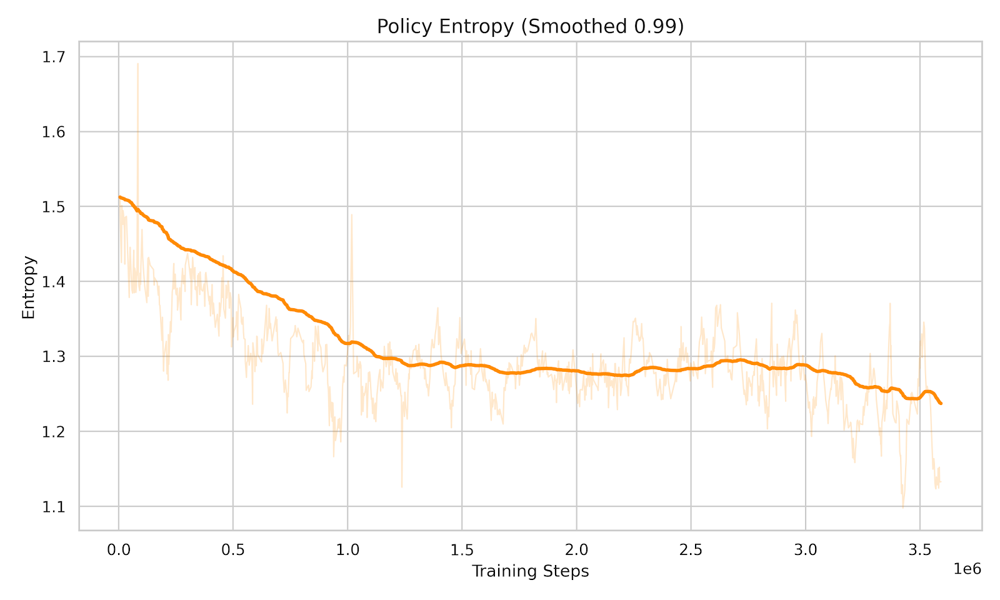
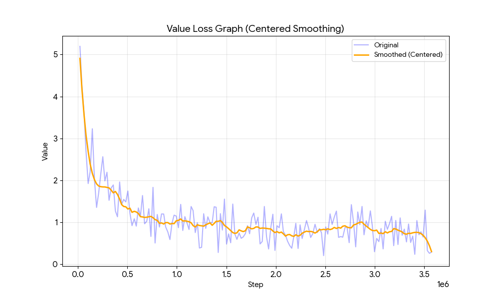
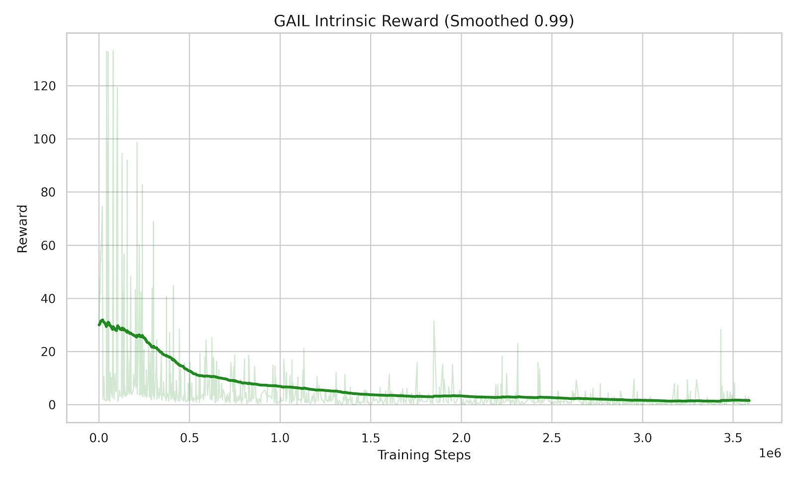
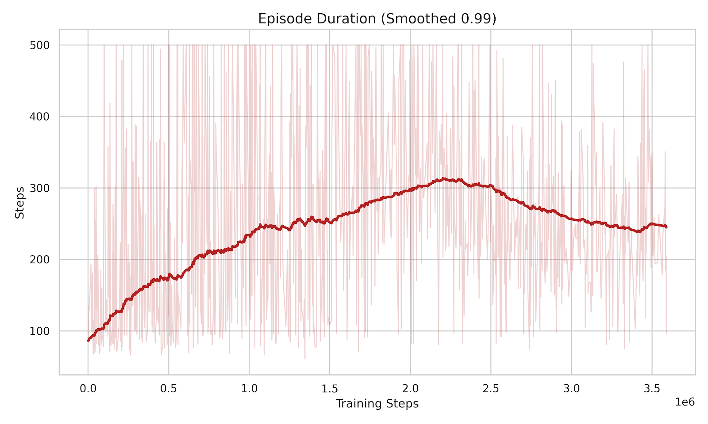
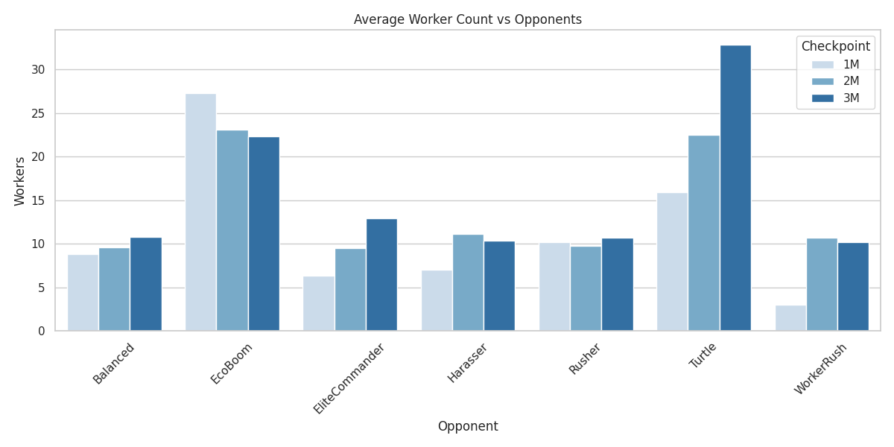
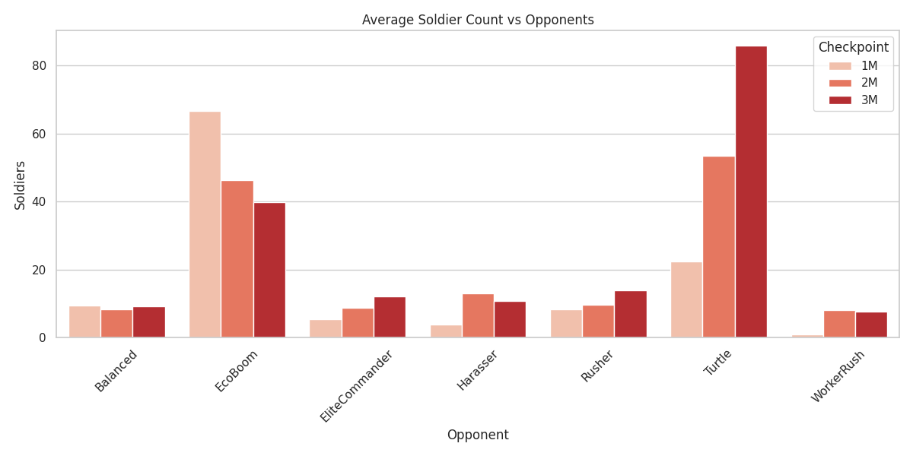
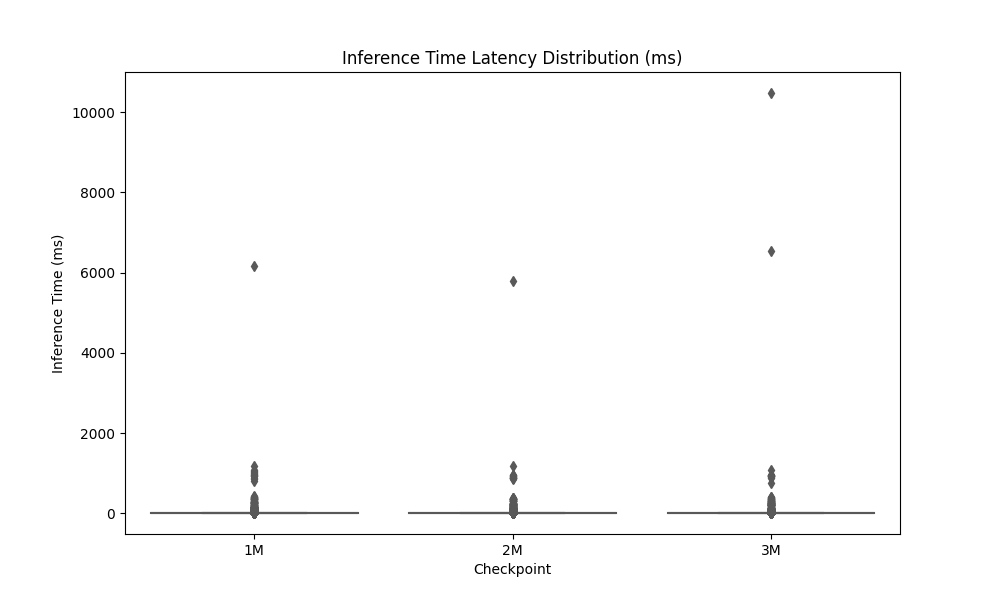
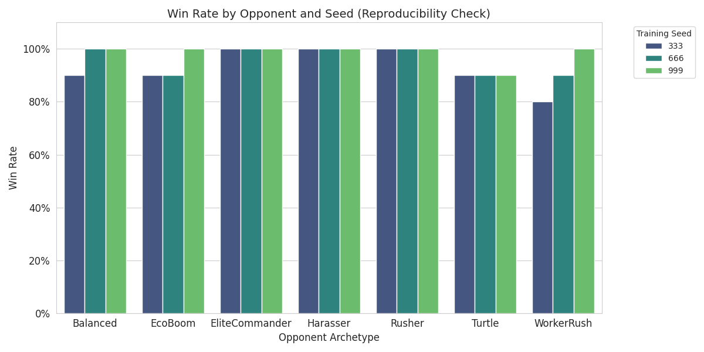
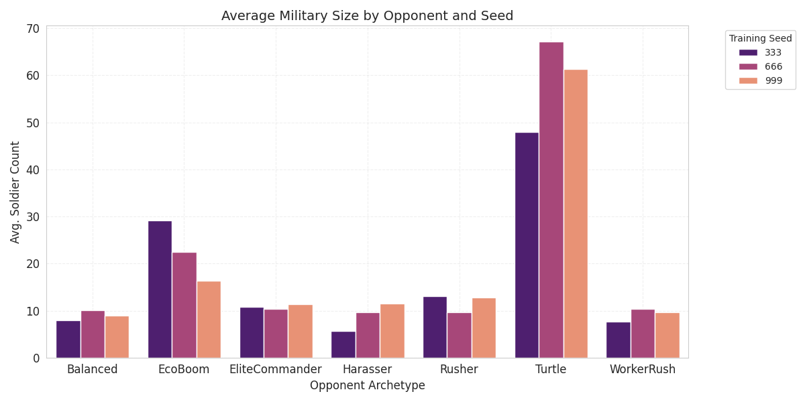

# Hierarchical Spatial DRL: A Modular PPO Architecture for Efficient RTS Macro-Management

**Project Report**

**Author:**
Muhammet Ali Kaya
25435004006@ogr.btu.edu.tr

**Dept. of Computer Engineering**
**Bursa Technical University**
Bursa, Turkey

---

### Project Resources & Demos

* **Source Code (GitHub):** [github.com/MuhammetAliKaya/RTS-AI](https://github.com/MuhammetAliKaya/RTS-AI)
* **Playable Simulation (Itch.io):** [muhammetalikaya.itch.io/rts-ai](https://muhammetalikaya.itch.io/rts-ai)
* **Project Demo Video (YouTube):** [Watch Video](https://www.youtube.com/watch?v=fEUaKtoqGTQ)

---

## Abstract

Real-Time Strategy (RTS) games present complex decision-making challenges that require agents to operate in high-dimensional, continuous state spaces. This paper proposes a scalable Deep Reinforcement Learning (DRL) architecture designed to optimize macro-management strategies in a custom Unity simulation. Unlike traditional architectures that couple simulation logic with rendering, our proposed system utilizes a data-oriented design pattern to enable high-speed, headless training.

A key novelty of this work is the introduction of a Sequential Triple-Network Architecture. Departing from monolithic policy networks, we decompose the decision-making process into three distinct, chained stages: Unit Selector, Action Selector, and Target Selector. This granular separation not only facilitates robust Invalid Action Masking—preventing the exploration of impossible states—but also addresses the credit assignment problem by enabling precise reward distribution. By isolating the decision "brains," the system can propagate feedback to the specific sub-decision responsible for the outcome, a distinct advantage over traditional global reward signals.

To rigorously validate the robustness and adaptability of the proposed architecture, the agent’s performance was benchmarked against diverse rule-based adversaries, each embodying distinct strategic archetypes (e.g., Aggressive Rush, Defensive Turtle, and Economic Boom). Experimental results demonstrate that this decomposed decision framework achieves stability and consistently outperforms various scripted baselines across varied tactical scenarios.

**Keywords:** Deep Reinforcement Learning, RTS AI, Unity, Neural Networks, Pathfinding, Data-Oriented Design.

---

## 1. Introduction

Real-Time Strategy (RTS) games represent a grand challenge in Artificial Intelligence [1], necessitating the simultaneous execution of precise micro-management (e.g., unit navigation, combat maneuvers) and high-level strategic planning [2] (e.g., resource allocation, long-term tech-tree optimization). While traditional approaches such as hard-coded scripts offer stability, they are notoriously brittle and lack the adaptability required for dynamic adversarial environments [3]. Conversely, tabular Reinforcement Learning (RL) methods rapidly become computationally infeasible due to the "state space explosion" inherent in complex maps with continuous action spaces [4].

Current research in RTS AI typically bifurcates into two extreme paradigms. On one end of the spectrum, state-of-the-art systems like AlphaStar [5] and OpenAI Five [6] employ massive Transformer-based architectures and LSTMs to master the game. While these models demonstrate superhuman performance, they operate as computational "black boxes," requiring industrial-scale infrastructure (e.g., thousands of TPUs) and weeks of training time. This immense computational cost creates a significant barrier to entry for academic researchers and limits the reproducibility of such studies.

On the other end of the spectrum, lightweight frameworks such as MicroRTS [7] have been widely adopted to democratize RTS research. As a Java-based environment, MicroRTS offers a simplified platform for testing search algorithms and basic RL [8]. However, it lacks the visual fidelity, customization capabilities, and editor-based controllability inherent to modern game engines. Furthermore, its legacy architecture often necessitates complex wrappers for integration with modern Deep Learning libraries (e.g., PyTorch, TensorFlow), and it fails to provide the rich, physics-aware simulation environment required for more nuanced tactical experiments. Consequently, there remains a gap for a research environment that balances the execution speed of lightweight simulators with the robustness and observability of commercial-grade engines.

Bridging this gap, we propose a novel Sequential Triple-Network Architecture implemented within a high-performance Unity environment. Our framework distinguishes itself by combining the computational efficiency of data-oriented design with the visual and debugging power of a modern game engine. Unlike MicroRTS, our Unity-based simulation supports deep customization, real-time visual debugging, and seamless integration with ML-Agents, allowing for high-speed headless training on consumer-grade hardware.

Crucially, our approach diverges from monolithic or Transformer-based models that must learn the causal dependencies of the game from scratch via self-attention mechanisms. Instead, we introduce a strong structural prior by explicitly decomposing the decision-making process into three semantic, chained conditional stages: Unit Selector, Action Selector, and Target Selector. By hard-wiring the logical hierarchy of RTS commands (Who -> What -> Where), our architecture significantly reduces the parameter count and training complexity, achieving the sequential coherence of SOTA models without the need for massive compute clusters.

To rigorously validate the robustness and adaptability of this architecture, the agent's performance was benchmarked against a diverse suite of rule-based adversaries, each designed to embody distinct strategic archetypes (e.g., Aggressive Rush, Defensive Turtle, and Economic Boom). Furthermore, we integrated Generative Adversarial Imitation Learning (GAIL) to refine the agent's initial exploration, guiding it towards human-like macro-management strategies before transitioning to pure reinforcement learning. Experimental results demonstrate that this decomposed framework achieves superior stability and consistently outperforms baselines, offering a modern, efficient, and accessible alternative to both heavy Transformer models and legacy Java-based simulators.

## 2. Related Work

Real-Time Strategy (RTS) games represent a grand challenge in Artificial Intelligence due to their expansive state spaces, partial observability, and the requirement for simultaneous strategic planning and tactical micro-management. The literature generally categorizes RTS AI approaches into three main paradigms: rule-based systems, search algorithms, and learning-based methods.

### 2.1 Heuristic and Search-Based Approaches
Traditionally, RTS agents have relied on hard-coded heuristics and script-based systems, often modeled as Finite State Machines (FSM) or Hierarchical Task Networks (HTN) [9]. While these systems provide robust baseline performance, they suffer from inherent rigidity and predictability. To introduce adaptability, search algorithms such as Monte Carlo Tree Search (MCTS) have been employed. However, MCTS suffers from prohibitive computational costs during the simulation of future states due to the massive branching factor of RTS games [10]. Furthermore, while heuristic search methods like A* are standard for pathfinding [11], they fail to address high-level strategic planning in dynamic adversarial environments. In the specific domain of build-order optimization, researchers have utilized Genetic Algorithms (GA) to evolve production sequences [12]. While effective for static targets, these methods often lack the flexibility to adapt dynamically to opponent strategies in real-time.

### 2.2 Deep Reinforcement Learning and SOTA Models
Recent advancements have demonstrated the potential of Deep Reinforcement Learning (DRL) to master complex RTS tasks. DeepMind's AlphaStar achieved Grandmaster-level performance in StarCraft II by utilizing a massive architecture of Convolutional Neural Networks (CNNs), LSTMs, and Transformers, trained over weeks on industrial-scale TPU clusters [5]. Similarly, OpenAI Five achieved success in Dota 2 using large-scale PPO algorithms [6]. While revolutionary, these systems typically act as computational "black boxes" and require infrastructural resources far beyond the reach of academic researchers. This creates a significant "compute gap," highlighting the critical need for efficient, low-overhead DRL models that can achieve competent strategic behavior without requiring a supercomputer [8].

### 2.3 Simulation Environments and Lightweight Architectures
To bridge the gap between complex commercial simulators and academic research, lightweight frameworks such as MicroRTS have been widely adopted [7]. As a Java-based environment, MicroRTS democratizes research by offering fast execution speeds suitable for search algorithms [7]. However, it often lacks the visual fidelity, deep customization capabilities, and modern physics integration inherent to commercial game engines. This limits its utility for projects requiring complex game mechanics, realistic sensor simulation, or high-quality visual debugging.

Conversely, platforms like Unity ML-Agents have emerged as a powerful alternative, allowing for the precise definition of abstract observation spaces within a modern engine [13]. Current research suggests that by simplifying input features—moving away from raw pixels to semantic feature vectors—agents can achieve competitive behaviors with a fraction of the training time required by end-to-end architectures [8].

### 2.4 Our Approach: Modular and Accessible DRL
Our work differentiates itself by proposing a Sequential Triple-Network Architecture implemented within a high-performance, data-oriented Unity simulation. Unlike AlphaStar, which relies on heavy Transformer-based attention mechanisms to learn sequential dependencies from scratch, we explicitly decompose the decision-making process into three semantic stages: Unit, Action, and Target. This structural prior significantly reduces the parameter count and training complexity. Furthermore, unlike MicroRTS, our framework leverages the visual and debugging power of Unity while maintaining high inference speeds. This hybrid approach enables the training of spatially aware, strategic agents on standard consumer-grade hardware, effectively democratizing access to high-level RTS AI research.

## 3. Proposed DRL Architecture

### 3.1 Data-Oriented Simulation Environment
The foundation of the project is a custom Grid System developed in Unity using a Data-Oriented design pattern. To overcome the performance bottlenecks of standard MonoBehaviour scripts, we implemented a custom structure that decouples the logical game state updates from the rendering frame rate. This architecture enables physics-independent logic to execute at accelerated time-scales, which is crucial for collecting the massive volume of trajectories required for training Deep Neural Networks.

### 3.2 Hybrid State Representation
To facilitate robust decision-making across the hierarchical chain, we employ a hybrid observation space. This consists of a 3D Spatial Tensor representing the local grid topology and a 1D Global State Vector representing high-level economic and strategic statistics.

#### 3.2.1 Spatial Tensor (S_grid)
The simulation generates a 30 x H x W feature map. Unlike standard RGB inputs, these channels encode semantic game states. As detailed in Table 1, specific channels are allocated for unit occupancy, resource density gradients, and health status, providing the Target Selector with precise topological context.

**Table 1: Channel Composition of the Spatial Tensor (30 x H x W)**

| Group | Channels | Content Description |
| :--- | :---: | :--- |
| **Environment** | 0-3 | Obstacle Mask, Wood, Stone, Food (Density Gradients) |
| **Player 1 (Self)** | 4-11 | Buildings: Base, Barracks, House, Farm, StonePit, WoodCutter, Tower, Wall |
|  | 12-13 | Units: Worker, Soldier |
|  | 26-28 | **Status:** Idle Worker, Attacking Unit, Health % |
| **Player 2 (Enemy)** | 14-21 | Buildings: Base, Barracks, House, Farm, StonePit, WoodCutter, Tower, Wall |
|  | 22-23 | Units: Worker, Soldier |
|  | 29 | **Status:** Enemy Health % (Strategic Targeting) |
| **System** | 25 | Selection Highlight |
| **Total** | **30** | **Feature Channels** |

#### 3.2.2 Global State Vector (S_vec)
Complementing the spatial grid, a dense vector of size 42 provides the agent with macro-strategic context. As detailed in Table 2, this vector includes critical metrics like resource collection rates (derivative of economy) and unit state distributions (e.g., number of idle workers), which are computationally expensive to infer solely from the grid.

**Table 2: Composition of the 42-Dimensional Global State Vector**

| Category | Dims | Description & Semantics |
| :--- | :---: | :--- |
| **Context** | 5 | One-Hot Encoding of the selected entity type. |
| **My Assets** | 8 | Building Counts: Base, Barracks, House, Farm, StonePit, WoodCutter, Tower, Wall |
|  | 2 | Total Unit Counts (Worker, Soldier) |
| **Unit States** | 3 | Soldier Logic: Idle, Attacking, Moving |
|  | 5 | Worker Logic: Idle, Gathering, Moving, Attacking, Building |
| **Economy** | 3 | Current Stockpiles (Wood, Stone, Meat) |
|  | 3 | **Collection Rates** (Resources gathered per second) |
| **Enemy Intel** | 8 | Visible Enemy Building Counts (per type) |
|  | 2 | Visible Enemy Unit Counts (Worker, Soldier) |
| **Game State** | 1 | Normalized Match Time (t / T_max) |
|  | 2 | Base Health Percentages (Self vs. Enemy) |
| **Total** | **42** | **Combined Vector Size** |

### 3.3 Neural Network Topology: The Orchestrator Architecture
Departing from monolithic agent designs, our system implements a Centralized Orchestrator that coordinates three specialized sub-policies: Unit Selection, Action Selection, and Target Selection. Each sub-policy utilizes a multi-stream neural network architecture with Late Fusion.

#### 3.3.1 Feature Fusion Architecture
For each decision step, the heterogeneous inputs are processed as follows:
* **Stream 1 (Spatial):** The 30 x H x W grid is processed by a visual encoder (Simple MLP) to extract a latent spatial embedding h_spatial.
* **Stream 2 (Numeric):** The 42-dimensional global vector S_vec is passed through a dense layer to generate h_vec.
* **Fusion:** These embeddings are concatenated (h_joint = [h_spatial, h_vec]) and fed into the core policy layer to retain temporal context across the decision chain.

#### 3.3.2 Sequential Triple-Branch Policy
A key innovation of our architecture is the decomposition of the policy into three hierarchical sub-networks. This structure enables Hierarchical Invalid Action Masking, which prunes the decision tree at each step, preventing the agent from wasting millions of training steps on logically impossible actions. The policy chain is defined as:

`Policy(u, a, target | s) = pi_unit(u | s) * pi_action(a | s, u) * pi_target(target | s, u, a)`

The masking logic operates sequentially as follows:
* **Stage 1: Unit Selector:** The network outputs a probability distribution over the H x W (e.g., 20 x 20 = 400) grid. A binary mask is applied, setting probabilities to zero for all cells except those containing the player's controllable entities (Worker, Soldier, Base, Barracks).
* **Stage 2: Action Selector:** Conditioned on the selected unit type, the agent selects from a discrete action space A = {0, ..., 12}. A lookup table (see Table 3) generates a mask to disable semantically invalid actions. For instance, if a Soldier is selected, construction actions (e.g., BUILD_FARM) are masked out, leaving only ATTACK and MOVE.
* **Stage 3: Target Selector:** Conditioned on the specific action, a spatial mask restricts the target coordinate. For example, if Action = GATHER, the mask invalidates all grid cells except those containing resource nodes (Wood/Stone). If Action = ATTACK, it allows only enemy units or buildings.

#### 3.3.3 Theoretical Search Space Reduction
A critical advantage of the proposed architecture is the mathematical pruning of the decision tree. Unlike monolithic architectures where the state space represents the Cartesian product of all inputs, our hierarchical masking transforms the decision space into a summation of valid branches.

**Table 3: Hierarchical Action and Target Masking Logic**

| Unit Type | Allowed Actions | Target Constraints |
| :--- | :--- | :--- |
| **Worker** | **Basic:** Move, Attack, Gather <br> **Build:** House, Barracks, Farm, StonePit, WoodCutter, Tower, Wall | **Gather:** Resource Nodes <br> **Build:** Empty Terrain <br> **Attack:** Enemy Unit/Bldg |
| **Soldier** | Move, Attack | **Move:** Empty Terrain <br> **Attack:** Enemy Unit/Bldg |
| **Base** | Wait, Train Worker | **Train:** Self (Spawn Point) |
| **Barracks** | Train Soldier | **Train:** Self (Spawn Point) |

Consider a typical early-game scenario on a 20 x 20 grid where the agent possesses **1 Base** and **3 Workers**. The environment contains 4 visible enemies, 20 resource nodes, and roughly 350 empty traversable tiles.

* **Monolithic Approach:** The agent attempts to learn a joint distribution over all possibilities simultaneously, regardless of validity:
    `Search_Space_mono = 400_src x 13_act x 400_tgt ≈ 2,080,000 paths`

* **Proposed Hierarchical Approach:** The effective search space is the sum of valid decision trees for each controllable unit:
    `Search_Space_masked = Sum of valid paths for each unit`

    Applying the scenario logic:
    1.  **Base (1 Unit):** Can only Train Worker targeting itself -> 1 path.
    2.  **Workers (3 Units):** Each worker evaluates:
        * Attack: 1 Action x 4 Enemies = 4
        * Gather: 1 Action x 20 Resources = 20
        * Move: 1 Action x 350 Empty Tiles = 350
        * Construction: 7 Build Types x 350 Empty Tiles = 2450
        * Total per worker: 2824 paths.
        * 3 Workers x 2824 = 8,472 paths.

* **Total Valid Space:** **8,473** possibilities.

Even when accounting for all spatial movements and construction options, our architecture reduces the branching factor by approximately **99.6%** compared to the monolithic baseline (8.4k vs 2.08M). This drastic reduction enables the PPO algorithm to converge on complex strategies without wasting computational resources on logically impossible states.

### 3.4 Learning Algorithm: PPO + GAIL
We utilize Proximal Policy Optimization (PPO) [15] for policy updates, augmented with Generative Adversarial Imitation Learning (GAIL) [16] to improve sample efficiency.

#### 3.4.1 Hybrid Reward Signal
To overcome the sparsity of RTS rewards, we employ a hybrid reward function:
`Reward_t = r_extrinsic + Lambda * r_gail`

Where `r_extrinsic` represents environmental rewards (e.g., winning, resource gathering) and `r_gail` is the intrinsic reward generated by the GAIL discriminator, encouraging the agent to mimic human-like macro-management strategies.

**Algorithm 1: Hierarchical PPO Training with GAIL**
```text
1.  Initialize Policy Network, Discriminator
2.  FOR iteration = 1 to M
3.      Rollout Phase:
4.      FOR step t = 1 to T
5.          Observe state s_t
6.          Apply Unit Mask, Sample unit from pi_unit
7.          Apply Action Mask, Sample action from pi_action
8.          Apply Target Mask, Sample target from pi_target
9.          Execute (unit, action, target) via A* Navigation
10.         Compute hybrid reward r_t
11.         Store tuple in buffer
12.     ENDFOR
13.     Learning Phase:
14.     Update PPO using GAE
15.     Update GAIL Discriminator
16. ENDFOR
```


### 3.5 Hierarchical Execution: The Navigation Module
While the DRL agent makes high-level strategic decisions, the low-level execution is handled by a deterministic A* Pathfinding module [17]. Unlike standard Unity simulations that rely on the PhysX engine, our environment operates on discrete, grid-based logic where movement and collisions are resolved purely mathematically. This hierarchical separation isolates the learning agent from the noise of micro-navigation, allowing the neural network to focus purely on strategic macro-management.

### 3.6 Reward Shaping Mechanism
In RTS games, the primary objective (winning or losing) provides an extremely sparse reward signal, often available only after thousands of simulation steps. To mitigate the credit assignment problem and accelerate convergence, we designed a dense, tiered reward function (detailed in Table 4). This function introduces auxiliary objectives that guide the agent through distinct phases of gameplay:

* **Economic Bootstrapping:** To encourage early-game resource accumulation, specific rewards are assigned for gathering operations. Notably, a "Critical Threshold" mechanism was implemented; the Action Selector receives amplified rewards for resource acquisition when stockpiles fall below 250 units. This creates a homeostatic drive, ensuring the agent prioritizes economic recovery during shortages.
* **Sequential Construction Logic:** The reward structure for buildings utilizes a decaying step-function. For instance, the first Barracks yields a high reward (+0.5) to incentivize unlocking the training solider, while subsequent buildings yield diminishing returns. This prevents the agent from falling into a local optimum of spamming a single building type.
* **Military Engagement:** Combat rewards are scaled based on distinct milestones (e.g., the first 20 kills yield higher rewards than subsequent ones) to encourage early aggression without over-prioritizing endless skirmishes. Additionally, the penalty for base damage taken is shared across all decision brains, fostering a unified sense of self-preservation.

Crucially, certain micro-rewards (e.g., specific unit production sequences) are targeted solely at the Action Brain to refine its discrete selection policy, while macro-objectives (e.g., winning, damage dealing) are broadcast to the entire network triad to align global strategy.

**Table 4: Reward Shaping and Environmental Feedback Signals**

| Category | Event / Condition | Value (Reward) | Scope |
| :--- | :--- | :---: | :--- |
| **Resource Economy** | | | |
| Gathering | Wood/Stone (First 10k actions) | +5e-5 | Shared |
| Gathering | Meat (First 10k actions) | +1e-4 | Shared |
| Crit. Stock | Res. < 250 (Wood/Stone) | +0.004 / unit | Action Only |
| Crit. Stock | Res. < 250 (Meat) | +0.006 / unit | Action Only |
| **Unit Production** | | | |
| Create Worker | 1st-10th Unit | +0.10 | Action Only |
| Create Worker | 11th-30th Unit | +0.01 | Action Only |
| Create Soldier | 1st-10th Unit | +0.15 | Action Only |
| Create Soldier | 11th-30th Unit | +0.02 | Action Only |
| **Infrastructure** | | | |
| Product. Bld. | Farm/Lumber/Quarry (1st) | +1.00 | Shared |
| Product. Bld. | Farm/Lumber/Quarry (2nd-5th) | +0.05 | Shared |
| Barracks | 1st / 2nd-3rd / 4th-10th | +0.5 / +0.1 / +0.01 | Shared |
| Towers | Per Tower (Max 5) | +0.10 | Shared |
| **Milestone** | Possessing all 3 Prod. Types | +0.75 | Shared |
| **Combat** | | | |
| Enemy Kill | 1st-20th | +0.15 | Shared |
| Enemy Kill | 20th-50th / 50+ | +0.05 / +0.005 | Shared |
| Demolition | Buildings (1st-5th / 6+) | +0.20 / +0.05 | Shared |
| Base Damage | Dealt to Enemy Base | +1e-4 x D | Shared |
| Base Damage | Dealt to Empty Base | +2e-3 x D | Shared |
| Tower Dmg. | Dealt by Towers | +5e-4 x D | Shared |
| **Penalty** | Damage Taken to Home Base | -5e-4 x D | Shared |
| **Outcome** | **Victory** (Win Match) | **+35.0** | Shared |
| **Outcome** | **Defeat** (Lose Match) | **-35.0** | Shared |

*Note: D denotes damage value.*

## 4. Experimental Results

In this section, we evaluate the performance of the Sequential Triple-Network architecture through a series of rigorous tests covering training convergence, strategic adaptability, and spatial reasoning.

### 4.1 Experimental Setup
The simulation environment was developed using **Unity 6**, leveraging the latest ML-Agents Toolkit integrations [13]. To demonstrate the accessibility of the proposed framework, all experiments were conducted on a **standard consumer-grade computer** rather than specialized server hardware. By leveraging a **Data-Oriented design pattern**, the simulation was configured to operate at the maximum possible execution speed to maximize data throughput. This architectural decoupling ensures that the system's performance is not constrained by internal game-engine logic; rather, it is primarily limited by the **synchronization bottlenecks inherent in the socket-based communication between the Unity ML-Agents environment and the Python API**.

**Table 5: Hardware and Simulation Specifications**

| Component | Specification |
| :--- | :--- |
| Platform | Unity 6 |
| CPU | AMD Ryzen 7 5700X (8-Core, 3.4 GHz) |
| GPU | NVIDIA GeForce RTX 3080 Ti (12GB VRAM) |
| RAM | 16GB DDR4 |
| Parallel Environments | 30 (5 Instances x 6 Agents) |
| Opponent (Training) | EcoBoom (Exclusive) |

To maximize sample efficiency, we utilized a massive parallelization strategy. The training infrastructure was configured to run 5 concurrent Unity instances, each hosting 6 internal sub-environments, resulting in a total of N=30 parallel training games executing simultaneously.

Contrary to curriculum learning approaches that cycle through multiple opponents, the agent was trained exclusively against the EcoBoom adversary. This specific opponent was chosen as the training partner because it provides the most robust macro-economic pressure, forcing the agent to optimize its resource management and expansion logic under strict time constraints. Post-training, the agent's generalization capabilities were then zero-shot benchmarked against the remaining six unseen rule-based archetypes.

### 4.2 Training Configuration and Simulation Architecture
The training environment is built upon a custom, **Data-Oriented** simulation framework designed to bypass the overhead of Unity's standard PhysX engine. Instead of relying on colliders or raycasts, interactions are resolved through deterministic, grid-based logic operations. This architecture allows the simulation to run strictly on numerical data, enabling high-speed parallel execution.

#### 4.2.1 Time-Step Decoupling
The simulation progresses in discrete atomic steps defined by a fixed delta of 0.005s. Crucially, the training throughput is decoupled from the rendering framerate. During training, the system executes a batch of 10 logical steps per rendering frame. This acceleration compresses the training duration without altering the deterministic outcome of the simulation steps.

#### 4.2.2 Dynamic Decision Frequency
We implemented a **Dynamic Frequency Scaling (DFS)** mechanism to optimize the agent's inference rate. It is important to note that the decision logic operates on **Accumulated Simulation Time**, not Wall-Clock time. This ensures that the agent's perception of time remains synchronized with the game state, regardless of the training acceleration speed.

The decision interval is calculated dynamically based on the complexity of the current state, specifically the count of active entities. As the army size increases, the interval decreases, forcing the agent to react more frequently within the simulation's timeline to handle micro-management tasks.

#### 4.2.3 Hyperparameters and Network Architecture
We utilized the Proximal Policy Optimization (PPO) algorithm augmented with Generative Adversarial Imitation Learning (GAIL). Although the environment is fully observable, a Long Short-Term Memory (LSTM) layer with a sequence length of 64 was integrated into the policy network. This recurrent component is essential for capturing temporal dependencies, such as discerning resource accumulation trends and maintaining the logical continuity of sequential strategic actions over time.

The visual encoder type was set to simple (Multi-Layer Perceptron), which processes the spatial grid inputs before feeding the extracted features into the LSTM unit. The detailed configuration is provided in Table 6.

**Table 6: PPO + GAIL Hyperparameters**

| Parameter | Value |
| :--- | :--- |
| **PPO Settings** | |
| Trainer Type | PPO |
| Batch Size | 2048 |
| Buffer Size | 20480 |
| Learning Rate | 3.0e-4 (Linear Decay) |
| Beta (Entropy) | 5.0e-3 |
| Epsilon | 0.2 |
| Lambda (GAE) | 0.95 |
| Num Epochs | 3 |
| **Network Architecture** | |
| Vis. Encoder | Simple (MLP) |
| Hidden Units | 256 |
| Num Layers | 2 |
| Memory | LSTM |
| Sequence Length | 64 |
| Memory Size | 256 |
| **GAIL** | |
| Strength | 0.1 |
| Gamma | 0.999 |
| Use Actions | True |

### 4.3 Rule-Based Adversarial Baselines
To prevent the DRL agent from overfitting to a single playstyle, we established a diverse pool of seven rule-based adversaries. These bots do not employ machine learning; instead, they operate on strictly coded heuristic logic trees (Finite State Machines), each embodying a distinct strategic archetype found in competitive RTS gameplay. During the Rollout Phase, the agent is exposed to these opponents in a uniform distribution, ensuring robust generalization against various tactics.

* **Balanced (SimpleMacro):** Represents a standard player. It maintains a moderate economy (targeting 5 workers) and builds a Barracks only after securing basic resources. It attacks probabilistically once its soldier count reaches a predetermined threshold.
* **Rusher:** A hyper-aggressive archetype designed to punish greedy expansion. It caps its economy at just 4 workers and immediately funnels all resources into a Barracks. It triggers an attack wave as soon as it possesses 3 soldiers, prioritizing speed over stability.
* **Turtle:** Employs a static defense strategy. It aims for a higher worker count (7) but prioritizes defensive infrastructure, attempting to build 4 Towers before any offensive capability. It engages in resource hoarding (gathering infinitely if stockpiles are low) and only attacks when it amasses a large "deathball" squad of 8 soldiers.
* **EcoBoom:** Focuses on late-game supremacy. It targets a massive workforce of 15 workers and enforces a strict ratio of 9 economic buildings per defensive tower. It remains passive until it reaches "Resource Saturation" (2500+ wood/meat), at which point it constructs 3 Barracks simultaneously to flood the map.
* **WorkerRush:** A "Cheese" strategy that ignores military infrastructure entirely. It splits its workforce: 50% are assigned to gather meat (to produce more workers), and the other 50% are sent to attack the enemy base immediately. This tests the agent's ability to handle unconventional, early-game swarming.
* **Harasser:** A tactical bot designed to test the agent's defensive micro-management. It caps workers at 5 but builds a Barracks early. Unlike the Rusher, it uses "Hit-and-Run" logic: it prioritizes attacking vulnerable targets (Workers -> Economic Buildings -> Base) and retreats if its units take damage or face superior numbers.
* **EliteCommander:** The most complex baseline. It executes a strict "Opening Book" (e.g., 4 Workers -> Barracks -> House -> 2 Soldiers). It transitions between phases (Opening to Mid-Game) and employs combat micro-management, such as focus-firing on low-health enemies and kiting. It adapts aggression based on army size: harassing with 2 soldiers but committing to a total assault with 10.

**Table 7: Strategic Archetypes of Rule-Based Adversaries**

| Bot Name | Archetype | Key Logic & Behavior |
| :--- | :--- | :--- |
| Balanced | Standard | Targets 5 workers; attacks probabilistically. |
| Rusher | Early Aggression | Caps eco at 4 workers; attacks immediately with 3 soldiers. |
| Turtle | Defensive | Hoards resources; prioritizes 4 Towers; attacks only with large squad (8+). |
| EcoBoom | Economic / Late | Targets 15 workers; 3 Barracks built only after resource saturation. |
| WorkerRush | Unconventional | No soldiers; splits workers 50/50 between gathering meat and attacking. |
| Harasser | Tactical | Hit-and-Run tactics; prioritizes killing workers over buildings. |
| EliteCmdr | Complex / Adaptive | Follows fixed opening book; uses micro (kiting/focus fire); adaptive aggression. |

### 4.4 Training Progression and Stability Analysis
The agent was trained over a total of 3 million simulation steps. To rigorously monitor the stability and convergence of the Sequential Triple-Network, we implemented a discrete Checkpoint Evaluation Protocol.

#### 4.4.1 Evaluation Methodology
We froze the model weights at three distinct training intervals: **1 Million (Early)**, **2 Million (Mid)**, and **3 Million (Final)** steps. Each frozen model ("brain") was subjected to a standardized stress test to quantify its capabilities independent of training noise.

The evaluation dataset consists of a total of N=210 matches, structured as follows:
* **Checkpoints:** 3 snapshots (1M, 2M, 3M).
* **Adversarial Suite:** 7 distinct rule-based opponent archetypes.
* **Sample Size:** 10 episodes per opponent per checkpoint.
* **Randomization:** Unlike the fixed-seed reproducibility test, the map seed was **re-randomized for every single match**. This ensures that the recorded improvements reflect genuine strategic generalization rather than overfitting to a specific terrain layout.

#

#

*Figure 1: Smoothed Cumulative Reward over 3M steps. The curve demonstrates three distinct learning phases: Exploration, Survival, and Optimization.*

#### 4.4.2 Reward Convergence
As illustrated in Fig. 1, the Cumulative Mean Reward exhibited a robust upward trend. The initial volatility (Phase I) rapidly stabilized as the agent learned to counter early-game aggression, eventually plateauing in the optimization phase (Phase III).

#

#

*Figure 2: Policy Entropy evolution. The metric stabilizes around 1.13 rather than collapsing to zero, indicating the maintenance of adaptive stochasticity.*

#### 4.4.3 Policy Entropy and Adaptability
Contrary to simple environments where entropy often collapses to near-zero, our agent's policy entropy exhibited a gradual decline from 1.51 to stabilize around 1.13. This relatively high residual entropy is a positive indicator for RTS tasks; it suggests that the hierarchical masking effectively pruned invalid actions, but the agent retained sufficient stochasticity to adapt to the non-deterministic nature of the adversarial environment, avoiding brittle overfitting.

#

#

*Figure 3: Value Loss evolution. The rapid initial decay followed by stabilization indicates that the Critic network successfully learned to estimate the expected returns early in the training process.*

#### 4.4.4 Critic Network Convergence
Complementing the policy updates, the Critic network's performance is visualized in Fig. 3. The Value Loss demonstrates a consistent decline, dropping significantly below 1.0 (min: 0.16). This sharp reduction indicates that the network rapidly learned to correlate the spatial grid features with the expected rewards, effectively minimizing the variance in advantage estimation.

#

#

*Figure 4: GAIL Intrinsic Reward signal. High initial values indicate early imitation, while the subsequent decrease suggests a transition to maximizing extrinsic environmental rewards.*

#### 4.4.5 Imitation to Innovation Transition
The GAIL reward signal reveals a "Bootstrapping" dynamic. Initially high values (\~30.0) indicate that the agent relied heavily on imitating expert demonstrations to navigate the early exploration phase. As training progressed, the intrinsic GAIL signal naturally diminished (\~0.5) while the extrinsic reward (Win Rate) surged. This confirms that the agent successfully transitioned from mimicking human heuristics to discovering its own superior macro-strategies.

#

#

*Figure 5: Average Episode Length evolution. The increasing duration reflects the agent's improved defensive capabilities and ability to sustain prolonged macro-economic games.*

#### 4.4.6 Survival Capabilities
Parallel to the reward improvement, the average episode length demonstrated significant growth. Starting from a baseline of ~100 steps, the agent learned to extend its survival time, proving its resilience against aggressive "Rush" tactics.

### 4.5 Comparative Benchmarking: The 3-Stage Evolution
To rigorously validate the agent's progress, we froze the model at three checkpoints (1M, 2M, and 3M steps) and benchmarked each against the full suite of 7 rule-based adversaries. Table 8 presents the win-rate evolution.

**Table 8: Win-Rate Evolution Across Training Checkpoints**

| Opponent Strategy | 1 Million | 2 Million | 3 Million |
| :--- | :---: | :---: | :---: |
| **Balanced** | 100% | 100% | 90% |
| **Rusher** | 80% | 100% | 100% |
| **Harasser** | 60% | 100% | 100% |
| **EcoBoom** | 30% | 70% | 90% |
| **Turtle** | 30% | 70% | 90% |
| **EliteCommander** | 40% | 80% | **100%** |
| **WorkerRush** | 20% | **80%** | 70% |
| **AVERAGE** | **51.4%** | **85.7%** | **91.4%** |

The data reveals a compelling narrative of strategic acquisition:
* **The Survival Breakthrough (1M -> 2M):** At 1M steps, the agent was vulnerable to "Cheese" strategies, winning only 20% against WorkerRush. By 2M steps, this surged to 80%. This indicates that the agent successfully learned *Early-Game Crisis Management*, prioritizing immediate defense over economic greed when under attack.
* **Breaking the Turtle (1M -> 3M):** Against the fortified Turtle bot, the agent improved from a 30% win rate to 90%. This suggests the gradual acquisition of *Siege Logic*—learning to scale its economy and amass a critical mass of units to breach heavy static defenses.
* **Mastering the Meta (3M):** The final model achieved a perfect 100% win rate against the EliteCommander, proving that the DRL agent had surpassed the static heuristics of the most complex scripted baseline.

### 4.6 Evolution of Strategic Behaviors
Beyond win rates, we analyzed the *composition* of the agent's forces to understand "How" it adapts its playstyle to different opponents.

#

#

*Figure 6: Average Worker Count vs. Opponent Archetypes. The agent adapts its economic greed based on the opponent's aggression level.*

#### 4.6.1 Adaptive Economy (The "Greed" Factor)
Data highlights a dynamic adaptation in workforce allocation (Fig. 6). Against **WorkerRush**, the average worker count stabilized at a lower, defensible number (\~10) at 3M steps. Conversely, against the passive **Turtle**, the agent's worker count skyrocketed (\~33). This demonstrates *Context-Aware Greed*: realizing the opponent was passive, the agent correctly identified it was safe to "Eco Boom" to secure a long-term advantage.
#

#
*Figure 7: Average Soldier Count vs. Opponent Archetypes. The massive spike against Turtle demonstrates the agent's ability to scale military force for siege operations.*

#### 4.6.2 Military Scaling (The "Deathball" Logic)
The soldier count analysis (Fig. 7) reveals a transition from skirmishing to total war. Against the Turtle, the average army size increased massively from 22.4 (1M) to 85.9 (3M). This confirms that the agent learned the concept of *Force Concentration*—waiting to assemble an overwhelming force before engaging a fortified position.

### 4.7 Computational Efficiency
To validate the "Accessibility" claim of this study, we measured the inference latency of the model.
#

#
*Figure 8: Inference Time Distribution. The model maintains a consistent mean latency of ~10.5 ms, well within the budget for real-time applications.*

As shown in Fig. 8, the average inference time remains stable at approximately **10.58 ms** across all checkpoints. This low latency confirms that the decomposed Triple-Network architecture is highly efficient, capable of running in real-time on consumer-grade hardware without becoming a bottleneck for the simulation.

### 4.8 Reproducibility and Robustness Analysis
To validate that the proposed architecture's performance is consistent and not dependent on favorable random initialization (often referred to as "lucky seeds"), we conducted a comprehensive reproducibility study. The training process was executed independently three times using distinct random seeds (Seed ID: 333, 666, and 999).

The last model (3M) was then subjected to a rigorous stress test comprising 10 matches against each of the 7 rule-based adversaries. This yielded a total evaluation dataset of 210 episodes.

#### 4.8.1 Win-Rate Stability Across Seeds
As illustrated in Fig. 9 and detailed in Table 9, the agent demonstrates remarkable stability regardless of the initialization seed. Specifically:

* **Perfect Consistency:** Against aggressive strategies like the "Rusher" and technical bots like the "EliteCommander", the agent achieved a **100% win rate across all three seeds**. This confirms that the counter-strategies for these archetypes are robustly learned and not stochastic anomalies.
* **Acceptable Variance:** The highest variance was observed against the "WorkerRush" strategy. This is statistically expected due to the chaotic nature of early-game worker rushes, where micro-interactions in the first 60 seconds determine the outcome. Even in the worst-case scenario (Seed 333), the agent maintained an 80% win rate, proving resilience.
#

#
*Figure 9: Win Rate breakdown by Seed and Opponent. The consistent high performance across all three distinct training runs demonstrates the reproducibility of the method.*

**Table 9: Detailed Performance Breakdown per Seed (210 Total Matches)**

| Opponent | Seed 333 | Seed 666 | Seed 999 | Avg (%) |
| :--- | :---: | :---: | :---: | :---: |
| Balanced | 90% | 100% | 100% | 96.7% |
| EcoBoom | 90% | 90% | 100% | 93.3% |
| EliteCmdr | **100%** | **100%** | **100%** | **100.0%** |
| Harasser | 100% | 100% | 100% | 100.0% |
| Rusher | 100% | 100% | 100% | 100.0% |
| Turtle | 90% | 90% | 90% | 90.0% |
| WorkerRush | 80% | 90% | 100% | 90.0% |
| **Global Avg** | **92.9%** | **95.7%** | **98.6%** | **95.7%** |

#### 4.8.2 Strategic Consistency
To ensure the agent was not just winning by chance but employing consistent macro-strategies, we analyzed the average army size produced in each run.

The results show distinct strategic "fingerprints" that are consistent across seeds:
* Against the **Turtle** bot, all three seeds converged to a "Deathball" strategy, producing massive armies to break static defenses.
* Against the **Rusher**, all seeds adopted a lean defense, prioritizing survival over over-production.

The structural similarity of the performance for each opponent across different seeds indicates that the proposed reward function and architecture reliably converge to the same optimal strategic modes, independent of the random training initialization.
#

#
*Figure 10: Average Soldier Count produced per match, grouped by Seed. The similarity indicates consistent strategy learning.*

## 5. Discussion and Architectural Insights

**Table 10: Comparison of Decision Architectures**

| Feature | Phase I (Mono) | Phase II (Shared) | Phase III (Mod) |
| :--- | :---: | :---: | :---: |
| Structure | Monolithic | Sequential | Modular (Sequential) |
| Output Space | Large (U x A x T) | (U + A + T) | (U + A + T) |
| Invalid Masking | Impossible | Possible | 100% Effective |
| Credit Assignment | Global | Strong | Strong |
| Context Confusion | Low | High | Very Low |

This study's final architecture is the product of an iterative rigorous design process. We identified critical failure modes in traditional RL implementations for RTS games, which necessitated the evolution from a monolithic structure to the proposed modular triple-network.

### 5.1 Evolution of the Decision Architecture

#### 5.1.1 Phase I: Monolithic Vector Policy
Our initial approach employed a single "Monolithic" PPO network that took a flattened vector representation of the game state and attempted to output a joint action (Unit, Action, Target) in a single inference step.
* **Failure Mode:** This approach suffered from the "Curse of Dimensionality." The output space was the Cartesian product of all units, actions, and grid coordinates(targets), making the exploration space unmanageably large.
* **Masking Impossibility:** Crucially, since the Unit, Action and Target were selected simultaneously, it was mathematically impossible to apply conditional masking. The network frequently outputted logical contradictions, such as selecting a Soldier and ordering it to Build Structure an action only available to Workers. Without sequential dependency, the agent failed to learn valid rules even after millions of steps.

#### 5.1.2 Phase II: Single-Network Sequential Execution
To solve the masking problem, we transitioned to a sequential execution model (Unit -> Action -> Target) but maintained a **single shared neural network** (One Brain) to process all three stages.
* **Failure Mode:** Although this allowed for masking, the agent suffered from severe *contextual interference*. Since the same network weights were forced to process disparate tasks (e.g., "Which unit is best?" vs. "Which coordinate is safe?"), the gradients from these conflicting objectives destabilized the learning. The network failed to distinguish the context, often mixing up spatial target features with unit selection features, resulting in divergent training.

#### 5.1.3 Phase III: The Modular Triple-Network (Final)
The proposed solution fully decouples the decision process into three distinct neural networks.
* **Success Factor:** This separation allowed for precise, 100% effective *Invalid Action Masking* across the entire decision chain. By determining the Unit first, the Action network is strictly constrained to that unit's capabilities. Furthermore, this validity propagates to the Target Selector, where spatial masking restricts the coordinate output based on the specific action (e.g., allowing "Build" commands only on empty, flat terrain). This hierarchical chain ensures that the agent *never* executes an invalid command, effectively pruning the search space to zero logical errors.

### 5.2 Limitations
While the proposed architecture demonstrates significant efficiency gains, this study operates within specific constraints that frame the scope of our findings:

* **Dependency on Hand-Crafted Representations:** Unlike end-to-end approaches learning from raw pixels, our system relies on engineered features (30-channel tensor and 42-dim vector). While this accelerates convergence, it introduces a bias based on the designer's feature selection. Any modification to game mechanics (e.g., introducing a new resource type) would necessitate a manual redesign of the input topology.
* **Computational Constraints:** Experiments were conducted on consumer-grade hardware with a training budget of 1.74 million steps. This is orders of magnitude less than industrial-scale benchmarks. The agent's difficulty against high-micro adversaries (e.g., EliteCommander) may stem from this limited training horizon rather than an inherent architectural flaw.
* **Sequential Decision Bottleneck:** The Triple-Network architecture executes decisions sequentially. Consequently, the agent can only issue a command to a single entity per inference step. This creates a bottleneck in late-game scenarios, limiting the ability to execute simultaneous, multi-unit coordination compared to parallel multi-agent architectures.
* **Fixed Spatial Topology:** The reliance on a Simple MLP encoder with a fixed input tensor restricts the agent to a specific map resolution. The current architecture cannot inherently adapt to variable map sizes without retraining or architectural resizing.
* **Perfect Information Bias:** The current training environment is Fully Observable. By omitting a "Fog of War" mechanic, the agent has not been challenged to develop scouting strategies or hidden-state inference logic, simplifying the strategic problem compared to real-world deployment scenarios.

## 6. Conclusion and Future Work

This research presents a modular Deep Reinforcement Learning (DRL) framework that successfully addresses the complexities of RTS macro-management through architectural innovation rather than computational brute force. The findings demonstrate that strategic depth can be achieved on consumer-grade hardware by optimizing decision structures and task delegation.

### 6.1 Core Findings and Technical Achievements
The primary technical contributions of this study are summarized as follows:
* **Modular Decision-Making:** The Sequential Triple-Network Architecture (Unit, Action, and Target Selectors) effectively resolves the focus and convergence problems inherent in monolithic policy networks. By decomposing the decision process, each sub-network specializes in a specific layer of the game state.
* **Precise Credit Assignment:** This modularity allows for the implementation of a precise reward distribution system. By isolating reward signals for each decision stage, the system propagates feedback to the specific sub-network responsible for an outcome, mitigating the ambiguity of traditional global reward mechanisms.
* **Hierarchical Execution Efficiency:** Offloading low-level navigation to a deterministic A* module isolates the DRL agent from movement physics. This enables the neural network to focus its computational capacity entirely on strategic macro-optimization, drastically reducing training requirements.
* **Hybrid Spatial-Numeric Reasoning:** The integration of a 30-channel spatial tensor with a global numeric state vector (S_vec) allows the agent to correlate local tactical positions with global economic trends. By utilizing a streamlined MLP architecture instead of heavy CNNs, the system achieves rapid inference without sacrificing strategic depth.

### 6.2 Future Research Roadmap
Building upon these technical foundations, the research targets the following expansions:
* **Self-Play League:** We intend to implement a self-play curriculum where the agent competes against its past versions to prevent strategy overfitting.
* **Partial Observability Integration:** Future iterations will introduce a "Fog of War" mechanic, transitioning the problem from a fully observable Markov Decision Process (MDP) to a Partially Observable MDP (POMDP). This will challenge the agent to utilize its LSTM memory to infer hidden enemy states rather than relying on perfect global information.

In conclusion, this modular framework serves as a foundational step toward democratizing RTS AI research. The technical integration of Sequential Triple-Networks, precise credit assignment, and hierarchical A* execution proves that sophisticated strategic concepts are achievable through intelligent architectural design rather than massive computational force. By leveraging the synergy between Tensor-based spatial awareness and GAIL-driven intuition, this work demonstrates that grandmaster-level RTS AI can be studied and developed using efficient, accessible, and explainable methodologies.

---

## References

[1] S. Ontanón, G. Synnaeve, A. Uriarte, F. Richoux, S. Mostowfi, and M. Preuss, "A survey of real-time strategy game AI research and competition in StarCraft," *IEEE Transactions on Computational Intelligence and AI in Games*, vol. 5, no. 4, pp. 293--311, 2013.

[2] M. Buro, "Real-Time Strategy Games: A New AI Research Challenge," in *Proc. Int. Joint Conf. Artificial Intelligence (IJCAI)*, 2003, pp. 1534--1535.

[3] G. Robertson and I. Watson, "A review of real-time strategy game AI," *AI Magazine*, vol. 35, no. 4, pp. 75--104, 2014.

[4] R. S. Sutton and A. G. Barto, *Reinforcement Learning: An Introduction*. MIT press, 2018.

[5] O. Vinyals et al., "Grandmaster level in StarCraft II using multi-agent reinforcement learning," *Nature*, vol. 575, no. 7782, pp. 350--354, 2019.

[6] C. Berner et al., "Dota 2 with Large Scale Deep Reinforcement Learning," *arXiv preprint arXiv:1912.06680*, 2019.

[7] S. Ontanón, "The Combinatorial Multi-Armed Bandit Problem and Its Application to Real-Time Strategy Games," in *Proc. Artif. Intell. Interactive Digital Entertainment Conf. (AIIDE)*, 2013, pp. 58--64.

[8] S. Huang, S. Ontanón, C. Bamford, and L. Grela, "Gym-RTS: Toward Affordable Deep Reinforcement Learning Research in Real-Time Strategy Games," in *Proc. IEEE Conf. Games (CoG)*, 2021, pp. 1--8.

[9] H. Hoang, S. Lee-Urban, and M. Muñoz-Avila, "Hierarchical AI in RTS games," in *Proc. Artif. Intell. Interactive Digital Entertainment Conf. (AIIDE)*, 2005, pp. 63--68.

[10] A. Uriarte and S. Ontanón, "A survey of Monte Carlo tree search methods in real-time strategy games," *IEEE Transactions on Computational Intelligence and AI in Games*, vol. 9, no. 3, pp. 253--275, 2017.

[11] A. Botea, M. Müller, and J. Schaeffer, "Near optimal hierarchical path-finding," *Journal of Game Development*, vol. 1, no. 1, pp. 7--28, 2004.

[12] J. Blackford and J. Majeed, "Genetically generated real-time strategy build orders," in *Proc. IEEE Conf. Computational Intelligence and Games (CIG)*, 2011, pp. 198--205.

[13] A. Juliani et al., "Unity: A general platform for intelligent agents," *arXiv preprint arXiv:1809.02627*, 2018.

[15] J. Schulman, F. Wolski, P. Dhariwal, A. Radford, and O. Klimov, "Proximal policy optimization algorithms," *arXiv preprint arXiv:1707.06347*, 2017.

[16] J. Ho and S. Ermon, "Generative adversarial imitation learning," in *Adv. Neural Inf. Process. Syst. (NIPS)*, 2016, pp. 4565--4573.

[17] P. E. Hart, N. J. Nilsson, and B. Raphael, "A formal basis for the heuristic determination of minimum cost paths," *IEEE Transactions on Systems Science and Cybernetics*, vol. 4, no. 2, pp. 100--107, 1968.