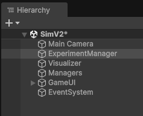

# RTS AI - DRL Course Based Approach

## 📌 Problem Definition
The problem is how to find the fastest way to build a **"Barracks"** in an RTS game. Barracks are important because if you have barracks before your opponent, you get the **chance of the first attack**. This chance is crucial for early game dominance.

**Base Goal:** Find the fastest way to build barracks through worker gathering and building capabilities using Deep Reinforcement Learning.

## 🧠 Estimated Strategy
**Recruiting more workers** for fast gathering is the estimated strategy derived from the algorithm. The expectation is shaped around the *more-worker / current-resource* balance.

---

## ⚙️ Environment Specifications
**Barracks cost:** 1000 wood + 1000 stone

**Worker cost:** 50 meat
### States Explained (64 Total States)
The environment consists of 64 discrete states calculated as: `4 * 4 * 2 * 2 = 64`.

* **Wood Level (4):** `[0-250]`, `[250-500]`, `[500-1000]`, `[1000+]`
* **Stone Level (4):** `[0-250]`, `[250-500]`, `[500-1000]`, `[1000+]`
* **Meat Level (2):** `[0-50]`, `[50+]`
* **Population Level (2):** `PopMax(1)`, `PopIsNotMax(0)`

### Action Space (5 Discrete Actions)
1.  Collect Wood
2.  Collect Stone
3.  Collect Meat
4.  Recruit Worker
5.  Build Barracks

### 🏆 Rewards System
| Action / Event  | Reward Value | Note |
| :------ | :------| :------ |
| **Step Punishment** &nbsp;&nbsp;&nbsp;&nbsp;&nbsp;&nbsp;&nbsp;&nbsp;| `-0.1f`&nbsp;&nbsp;&nbsp;&nbsp;&nbsp;&nbsp;&nbsp;&nbsp;&nbsp;&nbsp;&nbsp;&nbsp;&nbsp;&nbsp;&nbsp;&nbsp;&nbsp;&nbsp;&nbsp;&nbsp;&nbsp;&nbsp;&nbsp;&nbsp;&nbsp;&nbsp;&nbsp;&nbsp;&nbsp;&nbsp; | To encourage speed. |
| **Collect Wood** | `+5f` | Successful collection. |
| **Collect Stone** | `+5f` | Successful collection. |
| **Collect Meat** | `0f` | To avoid spending too much time on meat without recruiting. |
| **Recruit Worker** | `+50f` | High reward to encourage economy growth. |
| **Build Barracks** | `+1000f (+ Speed Bonus)` | **WIN CONDITION** . |

---

## 🏗️ Project Structure
The project structure is constructed based on **discrete structures**.
* **Main Distinction:** Separation between data and visual structure.
* **Headless Capability:** The game is completely playable with only data. It does not strictly need actual visual frames.

### Strong Aspects
* **Simulation Speed:** Thanks to the discrete structure, simulations can be completed without visuals. This allows for a very large amount of speed when conducting training simulations.

---

## 🚀 How to See and Test

### 1. Installation
Clone the repository to your local machine:
```bash
git clone [https://github.com/MuhammetAliKaya/RTS-AI.git](https://github.com/MuhammetAliKaya/RTS-AI.git)
```

### 2. Setup in Unity
1.  **Add** the cloned folder to **Unity Hub**.
2.  Open the project with **Unity version 6000.0.22** (or compatible).
3.  Navigate to: `Assets` => `Scenes` => **`SimV2`**.
4.  **Double click** to open the scene. You will initially see a blue screen with UI elements.

### 3. Running the Experiment
1.  In the Hierarchy window, find and select the **`ExperimentManager`** object.
2.  Check the **Inspector window**. Here you can find RL parameters, map size, and almost all variables regarding the game and RL.
3.  Press the **Play** button to watch the RL training in action.

<p align="center">
  
  <br><br> 
</p>

### 4. Modes and Features
* **Inference Mode:** If you want to watch a *pre-trained* model, check the `Run Inference Mode` box in the inspector. (Uncheck it to train from scratch).
* **Super Fast Training:** Check the `Run Fast` option and specify **Episodes per Frame**. This utilizes the data-driven structure to train at speeds limited only by your processor performance.
* **Visual Speed:** If `Run Fast` is too fast but normal speed is too slow, you can adjust the visual simulation speed variable(Uncheck Run Fast for visual speed).
---


## 🔮 What is Next?
Now that we have a good model for the fastest barracks build, what do we do with it?

* **Enemy AI Strategy:** The main usage is implementing this as one of the enemy AI's opening strategies.
* **Decision Making:** A more developed AI can use this as a function or decision-maker in specific cases.
    * *Example:* An attacker AI uses our **Q-Table** to make decisions in the first phase of the game. Once the AI acquires barracks, it switches back to its mid-game strategy.