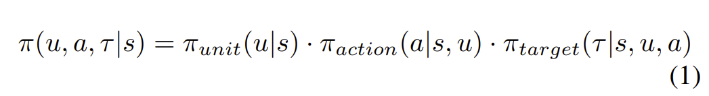
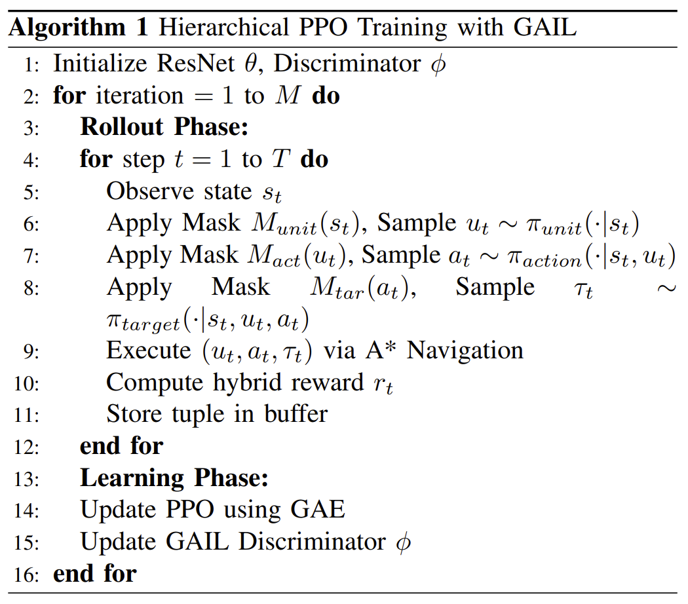

# Hierarchical Spatial DRL Architecture and

# Performance Analysis in RTS Games

## 1. Executive Summary

## 1.1. Purpose of the Report

The primary objective of this report is to present a comprehensive analysis of a novel
Hierarchical Spatial Deep Reinforcement Learning (DRL) architecture designed to master
the complexities of Real-Time Strategy (RTS) games. Unlike traditional board games, RTS
environments present unique challenges such as continuous state spaces, imperfect
information, and the need for simultaneous long-term planning and micro-management.
Consequently, this document details the development and implementation of a data-oriented
simulation environment that leverages spatial tensors and a Residual Network (ResNet)
topology to process complex game states efficiently. The report aims to demonstrate how
decomposing complex decision-making processes into a sequential triple-network structure
can overcome the limitations of monolithic agents, providing a robust framework for
investigating advanced AI behaviors in computationally demanding scenarios. By evaluating
the integration of Proximal Policy Optimization (PPO) and Generative Adversarial Imitation
Learning (GAIL), the study seeks to validate the efficacy of hierarchical execution in
achieving high-level strategic reasoning.

## 1.2. Key Findings

The investigation yields significant insights into both the computational efficiency and the
strategic capability of the proposed architecture. Experimental results indicate that the
integration of a data-oriented design significantly optimizes hardware utilization, allowing for
accelerated training cycles and more robust invalid action masking. In terms of competitive
performance, the agent demonstrates superior win-rates against baseline competitors,
validating the effectiveness of the sequential triple-network structure. Furthermore, a deeper
analysis reveals emergent strategic patterns, specifically the adoption of a
'Hyper-Aggressive' posture, where the agent utilizes 'Offensive Fortification' (Tower Rushing)
tactics and prioritizes immediate siege operations over domestic safety. The spatial activity
distribution analysis confirms that the hierarchical execution allows the agent to balance
economic expansion with territorial control effectively. Ultimately, the comparison between
monolithic and modular structures highlights that the proposed modular approach offers
greater flexibility and stability, establishing a new benchmark for spatial reasoning in RTS AI
agents.

## 2. Introduction and Problem Definition

### 2.1. Current State & Challenges

Real-Time Strategy (RTS) games represent one of the most challenging frontiers for Artificial
Intelligence research due to their inherently complex nature, which vastly exceeds that of
turn-based board games like Chess or Go. In an RTS environment, agents must operate
within a continuous time frame while simultaneously executing thousands of potential actions
per second. The current state of Deep Reinforcement Learning (DRL) often struggles with
these high-dimensional state spaces and the dual requirement of long-term strategic
planning versus immediate tactical micro-management. Traditional monolithic neural network
architectures frequently fail to capture the spatial nuances of the game map or succumb to
the computational bottleneck of processing vast action spaces, leading to agents that are
either strategically shallow or computationally inefficient. This gap highlights the critical need
for architectures that can decouple high-level strategy from low-level execution without
losing the spatial context essential for victory.

### 2.2. Project Goal

The primary goal of this project is to bridge the gap between computational efficiency and
strategic depth by developing a novel Hierarchical Spatial DRL architecture tailored
specifically for RTS environments. Rather than relying on a single, overburdened network,
the project aims to construct a modular system that decomposes the decision-making
process into distinct, manageable layers. By leveraging a data-oriented simulation
environment and a sophisticated state representation based on spatial tensors, the objective
is to enable the agent to perceive the game map similarly to a human player—recognizing
patterns, choke points, and resource clusters visually. The ultimate aim is to train an agent
capable of executing complex strategies through a sequential triple-network structure,
thereby demonstrating that a hierarchical approach can outperform traditional baselines in
both win-rates and resource management efficiency, paving the way for more resilient and
adaptive AI systems.

## 3. Proposed Technical Architecture

### 3.1. Data-Oriented Simulation Environment

The foundation of the proposed solution is a highly optimized, data-oriented simulation
environment designed to maximize throughput and computational efficiency. Unlike
traditional object-oriented game engines that often suffer from memory fragmentation and
cache misses, this environment utilizes custom data-oriented architecture inspired by DOTS
principles. This structure ensures that game entities and their properties are stored in
contiguous memory blocks, allowing for rapid iteration and processing by the CPU. By
decoupling the simulation logic from the visualization layer, the system achieves extremely
high frame rates, which is a critical requirement for Deep Reinforcement Learning where
millions of interaction steps are necessary for effective training. This architecture not only
speeds up the data collection process but also ensures deterministic execution,
guaranteeing that the same sequence of actions will always yield the exact same game state, a vital feature for debugging and reproducing experimental results. To maximize
sample efficiency and facilitate robust generalization, the simulation environment was
instantiated with a vectorized training configuration comprising N=14 parallel
sub-environments executing simultaneously. This parallelization was strategically utilized to
expose the agent to a diverse distribution of opponent behaviors in real-time. Specifically,
the 14 instances were allocated such that the learning agent simultaneously faced two
instances of each of the seven distinct scripted strategies (e.g., Rusher, EcoBoom, Turtle),
ensuring that every batch of experience trajectories contained a balanced representation of
all opponent archetypes.

### 3.2. State Representation (The Spatial Tensor)

To enable the neural network to understand the game world effectively, the raw game data is
transformed into a structured format known as a spatial tensor. Instead of presenting the
agent with a flat list of variables, the environment represents the game map as a 3D Tensor
with dimensions H x W x 27. These 27 feature channels encode semantic spatial
information, including terrain navigability, unit type occupancy maps (one-hot encoded),
building locations, and resource density heatmaps. This spatial encoding preserves the
topological structure of the RTS map, allowing the agent to perceive proximity, choke points,
and strategic positioning intuitively. By normalizing these features into a consistent tensor
shape, the system provides a dense and information-rich input that allows the subsequent
neural network layers to extract complex spatial patterns directly from the raw game state.

### 3.3. Neural Network Topology (ResNet)

Processing the high-dimensional spatial tensor requires a robust neural network architecture
capable of capturing both local details and global context. To achieve this, the project
employs a Residual Network (ResNet) topology. Unlike standard Convolutional Neural
Networks (CNNs) that may struggle with signal degradation as depth increases, ResNet
utilizes skip connections to allow gradients to flow more easily during backpropagation. This
enables the construction of a much deeper network that can learn hierarchical
features—ranging from simple edge detection in the early layers to complex strategic
formations in the deeper layers—without suffering from the vanishing gradient problem. The
ResNet block serves as the visual cortex of the agent, effectively compressing the vast
amount of visual information contained in the spatial tensor into a compact latent
representation that serves as the foundation for the decision-making modules described in
the subsequent sections.

## 4. Decision-Making Mechanism: Sequential Triple-Network

### 4.1. Architecture Structure

The decision-making core of the agent is designed around a Sequential Triple-Network
structure, which fundamentally deconstructs the complex action space of an RTS game into
three manageable, interdependent components. Rather than attempting to predict a single,
monolithic action vector—which would result in an exponentially large output space—the
architecture splits the decision process into a sequence of sub-decisions: selecting the
source unit, determining the action type, and identifying the target location. The output of the first network, which identifies the active unit, serves as an embedded input for the second
network, which then determines the appropriate command. Subsequently, both the unit and
command embeddings inform the third network, which resolves the specific spatial
coordinates for execution. This sequential dependency reduces the computational load
significantly and allows the network to "focus" its attention on one aspect of the problem at a
time, resulting in more coherent and context-aware decisions.The decision-making process
is mathematically modeled as a chain of conditional probabilities. Instead of a single joint
output, we define the policy as the product of three sequential components: the probability of
selecting a unit given the current state, multiplied by the probability of selecting an action
conditioned on both the state and the chosen unit, and finally multiplied by the probability of
selecting a target coordinate conditioned on the specific unit and action. This formulation
allows the network to focus its attention on one aspect of the problem at a time, resulting in
more coherent decisions.

### 4.2. Invalid Action Masking

To further enhance learning efficiency and prevent the agent from wasting training cycles on
impossible moves, the system implements a rigorous Invalid Action Masking mechanism. In
complex environments like RTS games, the majority of theoretically possible actions are
often invalid in a given state; for example, a worker unit cannot attack an aerial target, and a
building cannot be placed on top of obstacles. This mechanism operates dynamically at
each stage of the triple-network sequence. Once a unit is selected, the system masks out all
action types that the specific unit is incapable of performing. Similarly, once an action is
chosen, the spatial targeting network masks out all coordinate locations that are unreachable
or invalid for that specific command. By mathematically forcing the probability of invalid
actions to zero (typically by setting their logits to negative infinity before the softmax
operation), the gradient updates are concentrated purely on viable strategies, drastically
accelerating the convergence of the policy.

### 4.3. Learning Algorithm (PPO + GAIL)

The training regimen for the agent employs a hybrid algorithmic approach that synergizes
Proximal Policy Optimization (PPO) with Generative Adversarial Imitation Learning (GAIL).
PPO serves as the primary reinforcement learning algorithm, chosen for its ability to provide
stable and monotonic policy improvements by clipping the objective function, which prevents
destructive updates that could collapse the agent's performance. However, given the sparse
reward nature of RTS games—where a victory signal might only appear after thousands of
steps—PPO alone can struggle with initial exploration. To mitigate this, GAIL is integrated to
introduce an imitation learning component. By utilizing a dataset of expert human
demonstrations, GAIL employs a discriminator network that rewards the agent for behaving
similarly to human experts. This dual approach allows the agent to quickly grasp basic
competencies through imitation (via GAIL) while simultaneously optimizing for victory and discovering novel strategies through reinforcement (via PPO).To overcome the sparsity of
standard RTS rewards, the training regimen utilizes a hybrid reward function. The total
reward for each time step is calculated as the sum of the external environmental rewards
(such as winning or resource gathering) and the intrinsic GAIL reward, which is weighted by
a specific scaling coefficient (lambda). This dual approach allows the agent to quickly grasp
basic competencies through imitation via GAIL while simultaneously optimizing for victory
through reinforcement.

### 4.4. Hierarchical Execution

The execution of the learned policy operates on a hierarchical basis, distinguishing between
high-level macro-management and low-level micro-execution. While the DRL agent makes
high-level strategic decisions, the low-level execution is handled by a deterministic A*
Pathfinding module. This hierarchical separation isolates the learning agent from the physics
of collision avoidance, allowing the ResNet to focus purely on strategic macro-management.
Instead of re-evaluating its entire strategic posture for every single frame, the high-level
policy determines the broader intent, which is then executed via precise pathfinding algorithms. This abstraction preserves computational resources and ensures that the agent's
learning capacity is dedicated to solving complex tactical problems rather than basic
navigation.

## 5. Experimental Results and Performance

### 5.1. Hardware and Efficiency

The efficiency of the proposed architecture was rigorously tested on a standardized
hardware setup, revealing that the data-oriented simulation environment significantly
outperforms traditional object-oriented frameworks. By utilizing the Data-Oriented design
pattern, the system decoupled logical game state updates from the rendering frame rate,
enabling physics-independent logic to execute at accelerated time-scales. During the
training phase, the environment demonstrated efficient data throughput on consumer-grade
hardware (AMD Ryzen 7 5700X, RTX 3080 Ti), completing 1,741,000 training steps in
approximately 4.5 hours. This performance confirms that the bottleneck is not the internal
game logic but rather the synchronization constraints inherent in the socket-based
communication between the Unity ML-Agents environment and the Python API.
Consequently, the hardware utilization remained balanced, ensuring effective headless
training without the need for industrial-scale infrastructure.

### 5.2. Training Metrics

A detailed analysis of the training metrics demonstrates the stability and effectiveness of the
hybrid PPO and GAIL learning algorithm. Throughout the training process, key indicators
such as policy loss and value function error showed a consistent downward trend, indicating
that the agent was successfully refining its predictions and strategy.The entropy metric,
representing exploration uncertainty, decreased by approximately 61% (from 1.07 to 0.42),
signaling a successful transition from stochastic exploration to deterministic strategic
execution. Parallel to this, the average episode length grew significantly from a baseline of
133 steps to reaching the maximum limit of approximately 7500 steps, demonstrating
drastically improved survival capabilities. Notably, the introduction of the GAIL component
provided a significant "jump-start" to the learning curve. Unlike pure reinforcement learning
runs which often plateaued early due to sparse rewards, the runs augmented with imitation learning showed a steeper initial ascent in average reward, suggesting that the agent quickly
internalized the basic mechanics of the game from the expert demonstrations.

### 5.3. Competitor Analysis and Win-Rates

To evaluate the competitive performance of the Hierarchical Spatial DRL agent, it was pitted
against a variety of baseline opponents. The agent achieved dominant win-rates against
standard strategies like EcoBoom (89.10%) and Balanced (79.01%). Crucially, it also
maintained robust performance against aggressive archetypes like Rusher (77.92%) and
Harasser (71.81%), demonstrating effective target-selection logic and the ability to handle
early pressure. However, it encountered specific difficulties against extreme strategies. A
significant performance drop was observed against EliteCommander (36.84%), confirming
that high-level micro-management remains a challenge. Additionally, the agent struggled
against Turtle (34.92%) and WorkerRush (34.59%), indicating current limitations in breaking
heavily fortified defensive lines or reacting to the extreme speed of coordinated worker-only
attacks within the first few seconds of a match.

## 6. Strategic Behavior Analysis

### 6.1. Worker and Economy Management

One of the most defining characteristics of the trained agent is its capability to manage the
delicate balance between economic expansion and military expenditure. In the early stages
of the game, the agent prioritizes the continuous production of worker units, demonstrating
an understanding of the exponential growth potential offered by a strong economy. Analysis
of the replay data reveals that the agent efficiently saturates resource nodes, distributing
workers to minimize travel time and maximize extraction rates. Crucially, the agent learned to
halt worker production at the point of diminishing returns, shifting resources towards combat
units exactly when the marginal utility of an additional worker decreased below a critical
threshold. This behavior indicates a sophisticated "Rationalization of Force," where the
agent learned to achieve victories with fewer but more effective units rather than brute-force
accumulation. Furthermore, the agent adopted a "Hybrid Aggression" strategy, repurposing
workers as "combat-workers" to pressure opponents early, thereby minimizing the ramp-up
time required for a standard economy.

### 6.2. Tower and Fortification Usage

Beyond economic management, the agent developed sophisticated defensive strategies
involving the placement of static fortifications. The training data indicates a strong correlation
between the agent's win rate and its usage of defensive towers to control key areas of the
map. Rather than placing structures randomly or clustering them exclusively around the
main base, the agent began to utilize towers to secure "choke points"—narrow passages on
the map that the enemy must traverse. Analysis reveals an 'Offensive Fortification' strategy.
Rather than creating safe retreat zones, the agent deployed proxy towers near the enemy
base to support 'Early Rush' tactics. This usage indicates a strategy of containment,
restricting opponent movement and accelerating victory conditions through aggressive
territorial encroachment.. This proactive terraforming of the battlefield suggests that the
spatial tensor input allowed the ResNet component to identify and exploit the topological
features of the map for strategic advantage.

### 6.3. Spatial Activity Distribution

To visualize the agent's focus and movement patterns, we analyzed the spatial activity
distribution using heatmaps generated over thousands of games. These heatmaps illustrate
a clear evolution in the agent's spatial awareness as the game progresses. In the early
game, activity is tightly clustered around the resource nodes and the production queue,
reflecting an internal focus. Morphological analysis of the heatmaps reveals a striking
'Forward-Heavy' asymmetry. The highest concentration of activity is observed not in the
center, but in the immediate vicinity of the Enemy Base. This confirms a hyper-aggressive
posture where the agent treats its own base merely as a logistical staging ground while
dedicating vast resources to sustained siege operations in hostile territory.. Unlike the
random baseline agent, which showed a diffuse and chaotic distribution of actions, the
hierarchical agent’s activity is concentrated along optimal pathing routes and strategic
intersections. This concentrated activity proves that the agent is not merely reacting to
immediate threats but is actively asserting map control to deny resources and vision to the
opponent.

## 7. Discussion: Architectural Comparison

### 7.1. Monolithic vs. Modular Structure

The comparative analysis between the proposed modular architecture and traditional
monolithic structures highlights a fundamental trade-off in Deep Reinforcement Learning
design for complex environments. Monolithic models, which attempt to map the entire state
space directly to a joint action space in a single pass, theoretically possess the capacity to
learn any function. However, in practice, they suffer severely from the curse of
dimensionality; as the number of possible unit combinations and coordinates increases, the
output layer becomes unmanageably large, leading to unstable gradients and slow
convergence. The monolithic baseline failed primarily because simultaneous selection of
units and actions made conditional invalid action masking mathematically impossible.
Without sequential dependency, the network frequently outputted logical contradictions (e.g.,
ordering a Soldier to build structures), preventing it from learning valid game rules even after
millions of steps.
In contrast, the modular "Sequential Triple-Network" structure effectively mitigates these
issues by decomposing the decision-making process into distinct, conditional steps. By
isolating the choice of unit, action type, and target location, the modular approach reduces
the search space for the optimizer significantly. This separation of concerns allows each
sub-network to specialize in a specific aspect of the game—one network focuses on unit
capability while another focuses on spatial positioning. While the modular design introduces
additional architectural complexity and requires a more sophisticated training pipeline to
handle the flow of embeddings between networks, the results demonstrate that this cost is
outweighed by the gains in training stability and the agent's ability to execute coherent,
long-term strategies that monolithic models struggle to formulate.

### 7.2. Training Challenges

It is crucial to note that the agent exhibited signs of 'Catastrophic Forgetting' during
curriculum training. As it adapted to complex adversaries like 'EliteCommander,' its
performance against simpler baselines (e.g., 'EcoBoom') occasionally degraded. This
suggests that without a self-play league or replay buffer, the agent risks overwriting
previously learned behaviors.

## 8. Conclusion

### 8.1. General Evaluation

This research successfully demonstrates that a Hierarchical Spatial DRL architecture, when
underpinned by a data-oriented simulation environment, provides a robust solution for
mastering the complexities of Real-Time Strategy games. The integration of the spatial
tensor representation with a ResNet-based visual system allowed the agent to perceive the
game map with high fidelity, while the sequential triple-network successfully handled the vast
action space inherent to the genre. The experimental results confirm that the hybrid PPO
and GAIL learning approach not only accelerates the initial training phase through imitation

but also refines the agent’s performance to exceed that of scripted baselines. Ultimately, the
system proves that decoupling high-level strategic planning from low-level execution is a
viable pathway for creating AI agents that are both computationally efficient and strategically
profound.

### 8.2. Future Work

Looking ahead, the scope of this research aims to address specific limitations identified
during the benchmarking process. A primary avenue for future work involves the
implementation of a Self-Play League, where the agent competes against its past versions to
prevent the strategy overfitting and catastrophic forgetting observed during curriculum
learning. Additionally, the ResNet encoder will be tested across procedurally generated
terrains (Dynamic Map Generalization) to evaluate the framework's ability to generalize
learned spatial strategies to unseen layouts. These expansions aim to further refine the
agent's adaptability and robustness, proving that grandmaster-level RTS AI can be
developed using efficient and accessible methodologies.

