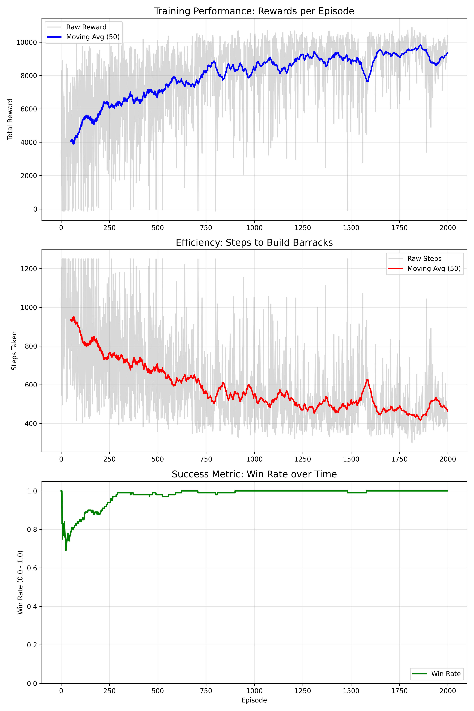
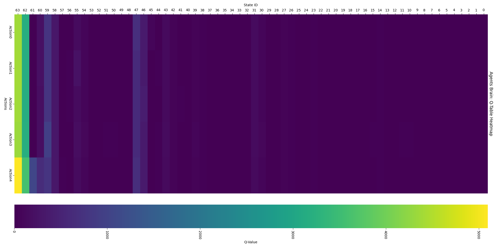

# RTS AI - DRL Course Based Approach

## 📌 Problem Definition
The problem is how to find the fastest way to build a **"Barracks"** in an RTS game. Barracks are important because if you have barracks before your opponent, you get the **chance of the first attack**. This chance is crucial for early game dominance.

**Base Goal:** Find the fastest way to build barracks through worker gathering and building capabilities using Reinforcement Learning.

## 🧠 Estimated Strategy
**Recruiting more workers** for fast gathering is the estimated strategy derived from the algorithm. The expectation is shaped around the *more-worker / current-resource* balance.


---
## 📐 Methodology & Approach

This project implements a **Reinforcement Learning** approach using the **Q-Learning** algorithm. The goal is to train an autonomous agent to make optimal decisions in a resource-constrained RTS environment.

### 1. The Q-Learning Algorithm
We utilized Q-Learning, an off-policy algorithm that seeks to find the best action to take given the current state. The "brain" of the agent is represented by a **Q-Table** (Lookup Table).

The agent updates its knowledge using the **Bellman Equation**:

> **Q(s,a) = Q(s,a) + α * [R + γ * max Q(s',a') - Q(s,a)]**

* **Q(s,a)**: Current confidence value of taking action *a* in state *s*.
* **R**: Immediate Reward received for the action.
* **max Q(s',a')**: Maximum expected future reward (Strategic vision).
* **α (Alpha)**: Learning Rate. Determines how fast new information overrides old habits.
* **γ (Gamma)**: Discount Factor. Determines the importance of future rewards vs immediate ones.

### 2. State Space Design (Discrete Buckets)
Instead of using a continuous state space (which would require deep neural networks like DQN), we designed a **Discrete State Space** to optimize learning speed and interpretability.

* **Bucket Approach:** Continuous variables (Wood, Stone, Meat) are discretized into "levels" to simplify the environment (e.g. `0-250` → `Level 0`).
* **Dimensionality:** This reduces the infinite possibilities to exactly **64 States** (4 * 4 * 2 * 2).
* **Efficiency:** With only 64 states and 5 actions, the Q-Table size is small (**320 entries**). This allows the agent to converge to an optimal policy in minutes rather than hours.

### 3. Exploration vs. Exploitation
The training utilizes an **Epsilon-Greedy Strategy**:
* **Exploration:** At the start (Epsilon = 1.0), the agent takes random actions to discover the environment.
* **Exploitation:** As training progresses, Epsilon decays (multiplied by `0.999` per episode), causing the agent to increasingly choose the action with the highest Q-Value.

### ⚙️ Hyperparameter Settings
The following hyperparameters were tuned to achieve the fast convergence:

| Parameter | Value | Justification |
| :--- | :--- | :--- |
| **Learning Rate (α)** | `0.10` | A moderate rate prevents oscillation while ensuring steady learning. |
| **Discount Factor (γ)** | `0.99` | A high value is critical because the main reward (Building Barracks) is delayed until the end. |
| **Epsilon Decay** | `0.999` | Slow decay allows sufficient exploration of the "Worker First" vs "Gather First" strategies. |
| **Total Episodes** | `2000+` | Sufficient duration for the Q-Table to stabilize (converge). |

---

## ⚙️ Environment Specifications
**Barracks cost:** 1000 wood + 1000 stone

**Worker cost:** 50 meat
### States Explained (64 Total States)
The environment consists of 64 discrete states calculated as: `4 * 4 * 2 * 2 = 64`.

* **Wood Level (4):** `[0-250]`, `[250-500]`, `[500-1000]`, `[1000+]`
* **Stone Level (4):** `[0-250]`, `[250-500]`, `[500-1000]`, `[1000+]`
* **Meat Level (2):** `[0-50]`, `[50+]`
* **Population Level (2):** `PopMax(1)`, `PopIsNotMax(0)`

### Action Space (5 Discrete Actions)
1.  Collect Wood
2.  Collect Stone
3.  Collect Meat
4.  Recruit Worker
5.  Build Barracks

### 🏆 Rewards System
| Action / Event  | Reward Value | Note |
| :------ | :------| :------ |
| **Step Punishment** &nbsp;&nbsp;&nbsp;&nbsp;&nbsp;&nbsp;&nbsp;&nbsp;| `-0.1f`&nbsp;&nbsp;&nbsp;&nbsp;&nbsp;&nbsp;&nbsp;&nbsp;&nbsp;&nbsp;&nbsp;&nbsp;&nbsp;&nbsp;&nbsp;&nbsp;&nbsp;&nbsp;&nbsp;&nbsp;&nbsp;&nbsp;&nbsp;&nbsp;&nbsp;&nbsp;&nbsp;&nbsp;&nbsp;&nbsp; | To encourage speed. |
| **Collect Wood** | `+5f` | Successful collection. |
| **Collect Stone** | `+5f` | Successful collection. |
| **Collect Meat** | `0f` | To avoid spending too much time on meat without recruiting. |
| **Recruit Worker** | `+50f` | High reward to encourage economy growth. |
| **Build Barracks** | `+1000f (+ Speed Bonus)` | **WIN CONDITION** . |

---

## 📊 Experimental Results

The training process was monitored over 2500+ episodes. The graphs below demonstrate the agent's learning curve and performance optimization.


*(Figure 1: Reward, Steps, and Win Rate change over episodes)*

### Analysis of Training Results:
* **Convergence:** Around **Episode 2000**, the reward stabilizes, indicating the agent has learned the optimal path and is no longer acting randomly.
* **Optimization:** The "Steps to Build" metric decreased from **1250+ steps** (timeout) to **~550 steps**. This **56% reduction** in build time validates the success of the 'Step Punishment' mechanism in teaching the agent to be fast.

---

## 🧠 Learned Policy Analysis (Q-Table)

To verify the agent's strategy, we analyzed the final Q-Table values. The heatmap below visualizes the agent's confidence in different states.


*(Figure 2: Heatmap of Q-Values showing agent's confidence in actions)*

### Strategic Insight
The agent successfully learned the causal relationship between resources and the objective:

| State (Wood/Stone) | Dominant Action | Interpretation |
| :--- | :--- | :--- |
| **Early Game (0, 0)** | `Collect Meat` / `Wood` | Agent knows it cannot build yet; prioritizes gathering resources and workers. |
| **Mid Game (500, 0)** | `Collect Stone` | Agent identifies the missing resource (Stone) and switches focus immediately. |
| **End Game (1000, 1000)** | **`Build Barracks`** | Q-Value spikes to **~3000**, triggering the win condition immediately when ready. |

---

## 🏗️ Project Structure
The project structure is constructed based on **discrete structures**.
* **Main Distinction:** Separation between data and visual structure.
* **Headless Capability:** The game is completely playable with only data. It does not strictly need actual visual frames.

### Strong Aspects
* **Simulation Speed:** Thanks to the discrete structure, simulations can be completed without visuals. This allows for a very large amount of speed when conducting training simulations.

---

## 🚀 How to See and Test

### 1. Installation
Clone the repository to your local machine:
```bash
git clone https://github.com/MuhammetAliKaya/RTS-AI.git
```

### 2. Setup in Unity
1.  **Add** the cloned folder to **Unity Hub**.
2.  Open the project with **Unity version 6000.0.22** (or compatible).
3.  Navigate to: `Assets` => `Scenes` => **`SimV2`**.
4.  **Double click** to open the scene. You will initially see a blue screen with UI elements.

### 3. Running the Experiment
1.  In the Hierarchy window, find and select the **`ExperimentManager`** object.
2.  Check the **Inspector window**. Here you can find RL parameters, map size, and almost all variables regarding the game and RL.
3.  Press the **Play** button to watch the RL training in action.

<p align="center">
  <br>
(Figure 3: Hieararchy Window)
  <br><br> <br>
  (Figure 4: Inspector Window)
</p>

### 4. Modes and Features
* **Inference Mode:** If you want to watch a *pre-trained* model, check the `Run Inference Mode` box in the inspector. (Uncheck it to train from scratch).
* **Super Fast Training:** Check the `Run Fast` option and specify **Episodes per Frame**. This utilizes the data-driven structure to train at speeds limited only by your processor performance.
* **Visual Speed:** If `Run Fast` is too fast but normal speed is too slow, you can adjust the visual simulation speed variable(Uncheck Run Fast for visual speed).

*(Figure 5: Training-Sim gif)*
---


## 🏁 Conclusion & Future Work

### Conclusion
This experiment demonstrated that a **Q-Learning agent** can successfully learn the optimal build order for a "Barracks Rush" strategy without any hard-coded logic. The agent learned to balance economy (worker production) with the main objective, reducing the construction time significantly compared to random actions.

### What is Next?
Now that we have a good model for the fastest barracks build, what do we do with it?

* **Enemy AI Strategy:** The main usage is implementing this as one of the enemy AI's opening strategies.
* **Decision Making:** A more developed AI can use this as a function or decision-maker in specific cases.
    * *Example:* An attacker AI uses our **Q-Table** to make decisions in the first phase of the game. Once the AI acquires barracks, it switches back to its mid-game strategy.